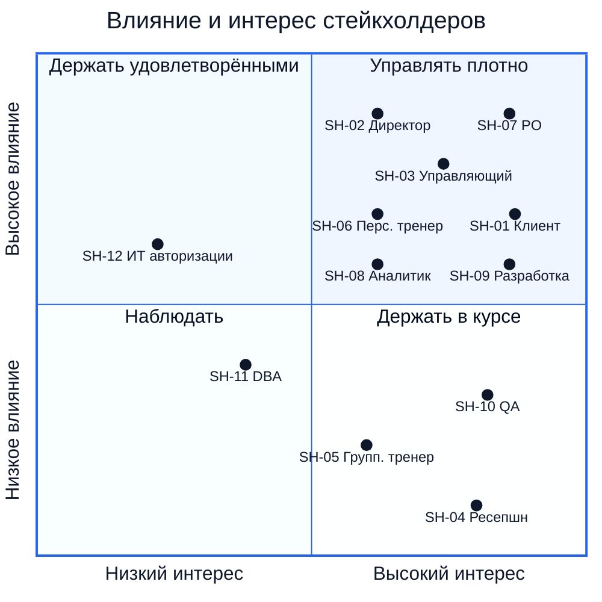

# 02. Заинтересованные стороны

## 2.1. Реестр стейкхолдеров

| ID | Стейкхолдер | Роль в проекте | Ключевые интересы | Влияние | Интерес |
|---|---|---|---|---|---|
| SH-01 | Клиент (держатель клубной карты) | Основной пользователь приложения | Быстро найти занятие и записаться, видеть свободные места, отменять без звонка, получать напоминания | Среднее | Высокий |
| SH-02 | Владелец / директор клуба | Спонсор проекта, утверждает цели и бюджет | Рост заполняемости, снижение затрат на ресепшн, отсутствие конфликтов с клиентами | Высокое | Высокий |
| SH-03 | Управляющий клубом | Бизнес-заказчик, источник правил записи и отмены | Настраиваемые правила (дедлайны), корректный учёт, данные для анализа спроса | Высокое | Высокий |
| SH-04 | Администратор ресепшн | Косвенный пользователь: консультирует клиентов, фиксирует изменения расписания | Меньше звонков, понятные статусы записей, чтобы отвечать клиентам | Низкое | Высокий |
| SH-05 | Тренер групповых занятий | Ведёт сеансы, источник информации о замене и отмене | Актуальный состав группы, своевременное оповещение клиентов об изменениях | Низкое | Средний |
| SH-06 | Персональный тренер | Владелец слотов персональных тренировок. Решает, какие часы открыть для онлайн-записи, об остальном договаривается с клиентами напрямую | Отсутствие накладок между онлайн-записью и прямыми договорённостями, заранее известная загрузка (запись не позже чем за 24 ч) | Среднее | Высокий |
| SH-07 | Product Owner | Управляет бэклогом и приоритетами MVP | Поставка в срок, достижение целей BG-01…BG-04 | Высокое | Высокий |
| SH-08 | Системный аналитик | Автор требований и моделей | Полнота и непротиворечивость требований, трассируемость | Среднее | Высокий |
| SH-09 | Команда разработки (backend, mobile) | Реализация | Однозначные требования, стабильные контракты API | Среднее | Высокий |
| SH-10 | QA | Проверка реализации | Проверяемые критерии приёмки, описанные краевые кейсы | Низкое | Высокий |
| SH-11 | Технический специалист клуба / DBA | Загружает и меняет мастер-данные (услуги, тренеры, сеансы) техническими средствами, так как админ-панели нет | Понятная модель данных и регламент изменений без поломки существующих записей | Среднее | Средний |
| SH-12 | Владелец сервиса аутентификации (ИТ клуба) | Поставщик внешнего сервиса, выдающего идентификатор пользователя | Стабильный контракт интеграции, отсутствие лишних персональных данных в новой системе | Среднее | Низкий |

## 2.2. Карта «влияние / интерес»

## 2.3. Как стейкхолдеры участвуют в требованиях

| Стейкхолдер | Что даёт проекту | Где это отражено |
|---|---|---|
| SH-02, SH-03 | Бизнес-цели, правила записи и отмены, пороги дедлайнов | [01](01-business-goal.md), [05](05-business-requirements.md) |
| SH-01 | Сценарии использования и ожидания от интерфейса | [06](06-user-requirements.md), [10](10-use-cases.md), [11](11-user-stories.md) |
| SH-04, SH-05, SH-06 | Сценарии отмены и замены со стороны клуба, требования к оповещению | [03](03-as-is-to-be.md), [05](05-business-requirements.md) |
| SH-11 | Регламент загрузки мастер-данных | [09](09-constraints-assumptions-edge-cases.md), [13](13-er-model.md) |
| SH-12 | Контракт интеграции с сервисом аутентификации | [12](12-c4.md), [16](16-api.md) |
