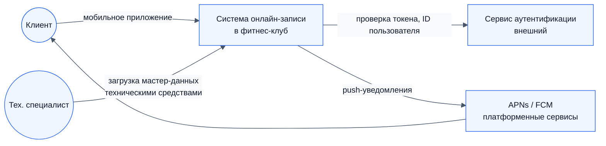

# 04. Границы проекта

## 4.1. Контекст системы

## 4.2. In Scope (MVP)

| ID | Что входит | Комментарий |
|---|---|---|
| IS-01 | Просмотр расписания групповых занятий и свободных персональных слотов на 14 дней вперёд | Фильтры: тип (групповое / персональное), вид занятия, тренер, уровень сложности |
| IS-02 | Карточка сеанса: время, длительность, зал, тренер, уровень, свободные места | «Осталось 7/25» |
| IS-03 | Запись на групповое занятие (до начала сеанса) | С атомарной проверкой вместимости |
| IS-04 | Запись на персональную тренировку (не позже чем за 24 ч) как бронь времени тренера | С проверкой занятости тренера. Стоимость, оплата и программа — по договорённости клиента с тренером напрямую |
| IS-05 | Раздел «Мои записи»: предстоящие и история | Статусы записи |
| IS-06 | Отмена записи клиентом до дедлайна: 30 мин (групповое) / 24 ч (персональное) | С атомарным возвратом места |
| IS-07 | Проверки: повторная запись, пересечение у клиента, пересечение у тренера, вместимость, окно записи | Все проверки на сервере |
| IS-08 | Обработка отмены сеанса (любого типа) и замены тренера на групповом занятии со стороны клуба | Изменение вносится технически, реакция системы автоматическая |
| IS-09 | Уведомления: системные push (APNs / FCM) + лента уведомлений в приложении | Подтверждение записи и отмены, напоминание за 2 ч, отмена / замена клубом |
| IS-10 | Автоматический перевод записей в статус «Завершена» после окончания сеанса | Без отметки посещения |
| IS-11 | Настраиваемые параметры: дедлайны записи и отмены, горизонт расписания, время напоминания | Хранятся в настройках, меняются без релиза |
| IS-12 | Интеграция с внешним сервисом аутентификации | Получаем только идентификатор пользователя |
| IS-13 | Спецификация REST API (OpenAPI 3.0) | [16-api.md](16-api.md) |

## 4.3. Out of Scope (MVP)

| ID | Что не входит | Почему | Когда вернёмся |
|---|---|---|---|
| OS-01 | Административная панель (управление услугами, тренерами, расписанием) | Граница MVP по ТЗ. Мастер-данные загружаются техническими средствами | Этап 2 |
| OS-02 | Регистрация, логин, восстановление пароля | В MVP аутентификация выполняется внешним сервисом (ТЗ, C-02). Собственные сценарии регистрации, входа и восстановления пароля нужны в перспективе, но не блокируют запуск записи | Этап 2 |
| OS-03 | Продажа и проверка клубных карт, тарифы, оплата | Держатель клубной карты автоматически имеет доступ ко всем групповым занятиям. Персональные тренировки оплачиваются вне системы | Этап 3 (при необходимости) |
| OS-04 | Лист ожидания на заполненные занятия | Групповые программы проходят ежедневно, спрос перераспределяется на следующие дни | Не планируется, пересмотр по метрикам |
| OS-07 | Сеть клубов, выбор клуба, «домашний клуб» | MVP для одного клуба. Модель данных допускает расширение | Этап 2 |
| OS-08 | SMS- и email-уведомления | Достаточно push + ленты в приложении | Этап 2 (сервис уведомлений) |
| OS-10 | Интерфейс тренера: свой состав групп, открытие и закрытие слотов, подтверждение заявок на персональные тренировки | Нет в ТЗ | Этап 2 |
| OS-12 | Цена, оплата и программа персональной тренировки | Клиент и тренер договариваются напрямую, мимо клуба. Система бронирует только время | Не планируется |
| OS-13 | Учёт прямых договорённостей клиента и тренера | Происходят вне системы. Тренер просто не открывает эти часы для онлайн-записи (допущение A-04) | Этап 2, вместе с OS-10 |
| OS-11 | Аналитические дашборды | Метрики BG считаются выгрузками из БД | Этап 2 |

## 4.4. Внешние зависимости

| ID | Зависимость | Что от неё нужно | Риск при недоступности |
|---|---|---|---|
| DEP-01 | Сервис аутентификации | Валидация токена и идентификатор пользователя | Клиент не может войти, запись невозможна |
| DEP-02 | APNs / FCM | Доставка системных push | Уведомление остаётся в ленте приложения, запись не блокируется |
| DEP-03 | Технический специалист (SH-11) | Загрузка сеансов на 14 дней вперёд и внесение изменений | В расписании нет сеансов, записаться не на что |
