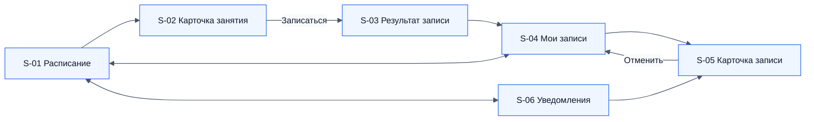

# 06. Пользовательские требования

Пользовательское требование (`UR`) описывает, **что пользователь должен иметь возможность сделать** и что он при этом видит. Это требование к продукту, оно не зависит от того, как работа будет нарезана на спринты. Нарезка на задачи для команды с критериями приёмки — это юзер-стори в [разделе 11](11-user-stories.md), где одно UR обычно раскрывается несколькими историями. Каждое UR выводится из бизнес-требований ([раздел 05](05-business-requirements.md)) и далее раскрывается функциональными требованиями ([раздел 07](07-functional-requirements.md)).

## 6.1. Роли пользователей

| Роль | Кто это | Как работает с системой |
|---|---|---|
| Клиент | Держатель клубной карты (SH-01) | Мобильное приложение: расписание, запись, отмена, уведомления |
| Тех. специалист | Сотрудник, загружающий данные (SH-11) | Технические средства (скрипты / SQL) по регламенту, без интерфейса |
| Управляющий | SH-03 | Через заявки тех. специалисту и выгрузки из БД |
| Персональный тренер | SH-06 | Сообщает, какие часы открыть или закрыть для онлайн-записи. Интерфейса в MVP нет |

## 6.2. Требования клиента

| ID | Требование | BR | Приоритет |
|---|---|---|---|
| UR-01 | Клиент должен иметь возможность просматривать расписание по дням и переключаться между днями в пределах 14 дней, начиная с сегодня. | BR-01 | Must |
| UR-02 | Клиент должен видеть у каждого занятия время начала и окончания, вид, тип, тренера, зал, уровень и число свободных мест («Осталось 7 из 25»). | BR-01 | Must |
| UR-03 | Клиент должен иметь возможность фильтровать расписание по типу (групповое / персональное), виду занятия, тренеру и уровню, а также сбрасывать фильтры. | BR-02 | Should |
| UR-04 | Клиент должен иметь возможность открыть карточку занятия с описанием вида занятия. Для персональной тренировки в карточке должна быть пометка «Стоимость и оплата — по договорённости с тренером». | BR-01, BR-04 | Must |
| UR-05 | Клиент должен иметь возможность записаться на групповое занятие из карточки одной кнопкой и сразу увидеть результат. | BR-03 | Must |
| UR-06 | Клиент должен иметь возможность забронировать свободный слот персональной тренировки у выбранного тренера. | BR-04 | Must |
| UR-07 | При отказе в записи клиент должен видеть понятную причину и, если возможно, что делать дальше. | BR-05…BR-08 | Must |
| UR-08 | Клиент должен иметь возможность просматривать свои предстоящие записи и историю со статусами. | BR-09, BR-12 | Must |
| UR-09 | Клиент должен иметь возможность отменить предстоящую запись и заранее видеть, до какого времени это можно сделать («Отменить можно до 18:30»). | BR-09, BR-10 | Must |
| UR-10 | Клиент должен иметь возможность отменить запись вне дедлайна, если на групповом занятии заменили тренера. | BR-14 | Should |
| UR-11 | Клиент должен получать push-уведомления и видеть их в ленте приложения со счётчиком непрочитанных. | BR-15, BR-16 | Must |
| UR-12 | Клиент должен видеть актуальное число свободных мест: данные обновляются при возврате на экран и по жесту «потянуть вниз». | BR-10 | Should |

## 6.3. Требования остальных ролей

| ID | Роль | Требование | BR | Приоритет |
|---|---|---|---|---|
| UR-13 | Тех. специалист | Загружать и изменять залы, тренеров, виды занятий и сеансы по документированному шаблону без нарушения существующих записей | BR-01 | Must |
| UR-14 | Тех. специалист | Отменять сеанс и заменять тренера группового занятия одной технической операцией, которая запускает автоматическую обработку записей и уведомлений | BR-13, BR-14 | Must |
| UR-15 | Управляющий | Менять дедлайны записи и отмены, горизонт расписания и время напоминания без выпуска новой версии | BR-11 | Should |
| UR-16 | Управляющий | Получать выгрузки для расчёта метрик BG-01…BG-04 | BR-18 | Must |
| UR-17 | Персональный тренер | Открывать для онлайн-записи только выбранные часы и закрывать ещё не занятый слот, если время ушло под прямую договорённость | BR-04, BR-07 | Must |

## 6.4. Экраны мобильного приложения

| Экран | Назначение | Ключевые элементы | UR |
|---|---|---|---|
| S-01 Расписание | Главный экран | Лента дней (14 дней, сегодня выбран), фильтры (тип, вид, тренер, уровень), список занятий дня: время, вид, тренер, зал, уровень, бейдж мест: «Осталось 7 из 25», «Мест нет», «Запись закрыта», «Вы записаны» | UR-01…UR-03, UR-12 |
| S-02 Карточка занятия | Детали и запись | Вид и описание, дата и время, длительность, тренер, зал, уровень, места. Кнопка «Записаться», неактивна с подписью причины, если записаться нельзя. Для персональной — пометка про оплату | UR-04…UR-07 |
| S-03 Результат записи | Подтверждение | «Вы записаны на Йогу, пн 19:00» + «Отменить можно до пн 18:30» или причина отказа | UR-05…UR-07 |
| S-04 Мои записи | Свои записи | Вкладки «Предстоящие» / «История», статус каждой записи | UR-08 |
| S-05 Карточка записи | Управление записью | Детали, статус, «Отменить можно до …», кнопка «Отменить» (активна до дедлайна или при замене тренера) | UR-09, UR-10 |
| S-06 Уведомления | Лента | Список уведомлений, непрочитанные выделены, переход к записи | UR-11 |

## 6.5. Сообщения пользователю

Тексты сообщений являются частью требований: коды причин из [API](16-api.md) должны отображаться клиенту именно так.

| Код причины | Сообщение клиенту |
|---|---|
| `SESSION_FULL` | Мест нет — все места уже заняты. Посмотрите это занятие в другие дни |
| `ALREADY_BOOKED` | Вы уже записаны на это занятие |
| `CLIENT_TIME_CONFLICT` | В это время у вас уже есть запись: {вид}, {время}. Отмените её, чтобы записаться сюда |
| `TRAINER_BUSY` | Тренер в это время занят. Выберите другой слот |
| `BOOKING_CLOSED` | Запись на это занятие закрыта. На персональные тренировки можно записаться не позже чем за 24 часа |
| `OUT_OF_HORIZON` | Запись открывается за 14 дней до занятия |
| `SESSION_CANCELLED` | Занятие отменено клубом |
| `CANCELLATION_DEADLINE_PASSED` | Отменить запись уже нельзя: срок отмены истёк в {время} |
| Технический сбой | Не удалось выполнить действие. Проверьте интернет и попробуйте ещё раз |
