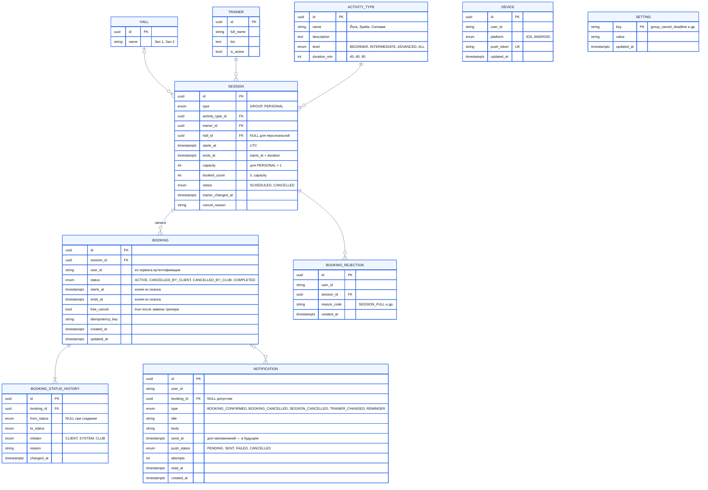

# 13. Модель данных (ER)

Модель сознательно компактная: **пять доменных сущностей** (зал, тренер, вид занятия, сеанс, запись) и **четыре служебных** (история статусов, уведомление, устройство, настройка), плюс журнал отказов для метрик. Групповые и персональные занятия объединены в одну сущность «Сеанс», как и предлагает ТЗ.

## 13.1. Диаграмма

> `DEVICE` и `SETTING` не связаны внешними ключами с остальными таблицами: устройство привязано к `user_id`, а клиент — внешняя сущность (C-02). Настройки — справочник «ключ–значение».

## 13.2. Описание сущностей

| Сущность | Назначение | Кто создаёт | Требования |
|---|---|---|---|
| `HALL` | Зал клуба | Тех. специалист | UR-13 |
| `TRAINER` | Тренер групповых и персональных занятий | Тех. специалист | UR-13 |
| `ACTIVITY_TYPE` | Вид занятия: название, описание, уровень, фиксированная длительность | Тех. специалист | C-03, FR-07 |
| `SESSION` | Конкретное занятие в расписании: групповой сеанс или персональный слот. Единая сущность с типом и вместимостью | Тех. специалист | C-04, FR-04…FR-08 |
| `BOOKING` | Запись клиента на сеанс | Клиент через API | FR-09…FR-21 |
| `BOOKING_STATUS_HISTORY` | Все переходы статуса записи с инициатором | Система | FR-31, NFR-14 |
| `NOTIFICATION` | Лента уведомлений и одновременно очередь на отправку push (outbox), включая запланированные напоминания | Система | FR-26…FR-29, ADR-03, ADR-04 |
| `DEVICE` | Токены устройств клиента для push | Клиент через API | FR-29 |
| `SETTING` | Параметры правил записи | Тех. специалист по заявке | FR-30 |
| `BOOKING_REJECTION` | Журнал отказов в записи для метрик | Система | FR-32, BR-18 |

**Почему в `BOOKING` дублируются `starts_at` и `ends_at`.** Это нужно, чтобы на уровне БД запретить пересекающиеся активные записи одного клиента (FR-12) одним exclusion-ограничением. Копия не расходится с сеансом, потому что время сеанса с активными записями менять нельзя (FR-24).

**Почему нет сущности «Клиент».** Клиент живёт во внешнем сервисе аутентификации, система хранит только `user_id` (FR-02).

## 13.3. Ограничения целостности

| Таблица | Ограничение | Зачем | Требования |
|---|---|---|---|
| `SESSION` | `CHECK (booked_count BETWEEN 0 AND capacity)` | Овербукинг невозможен даже при ошибке в коде | BR-05 |
| `SESSION` | `CHECK (type <> 'PERSONAL' OR capacity = 1)` | Персональная тренировка — строго на одного | C-04 |
| `SESSION` | `CHECK (ends_at > starts_at)` | Корректный интервал | — |
| `BOOKING` | Уникальный частичный индекс `(session_id, user_id) WHERE status = 'ACTIVE'` | Одна активная запись клиента на сеанс, повторная запись после отмены возможна | FR-11, FR-21 |
| `BOOKING` | `EXCLUDE USING gist (user_id WITH =, tstzrange(starts_at, ends_at) WITH &&) WHERE status = 'ACTIVE'` | Нет пересекающихся активных записей у клиента. Диапазон полуоткрытый `[start, end)` | FR-12 |
| `BOOKING` | Уникальность `(user_id, idempotency_key)` | Повтор запроса не создаёт вторую запись | FR-14 |
| `DEVICE` | Уникальность `push_token` | Один токен — одно устройство | FR-29 |

## 13.4. Индексы под ключевые запросы

| Запрос | Индекс |
|---|---|
| Расписание на день | `SESSION (starts_at) WHERE status = 'SCHEDULED'` |
| Занятость тренера при брони персонального слота | `SESSION (trainer_id, starts_at)` |
| «Мои записи» | `BOOKING (user_id, starts_at DESC)` |
| Выборка уведомлений к отправке | `NOTIFICATION (send_at) WHERE push_status = 'PENDING'` |
| Лента уведомлений | `NOTIFICATION (user_id, created_at DESC)` |
| Завершение прошедших записей | `BOOKING (ends_at) WHERE status = 'ACTIVE'` |

## 13.5. Расширение до сети клубов (Этап 2)

Добавляется таблица `CLUB` и внешний ключ `club_id` в `HALL`, `TRAINER` и `SESSION`, а параметр `club_timezone` переезжает в `CLUB`. Сценарии записи и отмены не меняются (BR-19).
