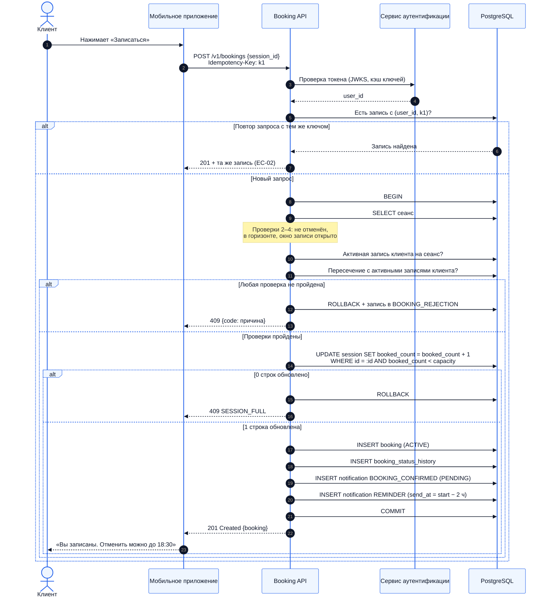
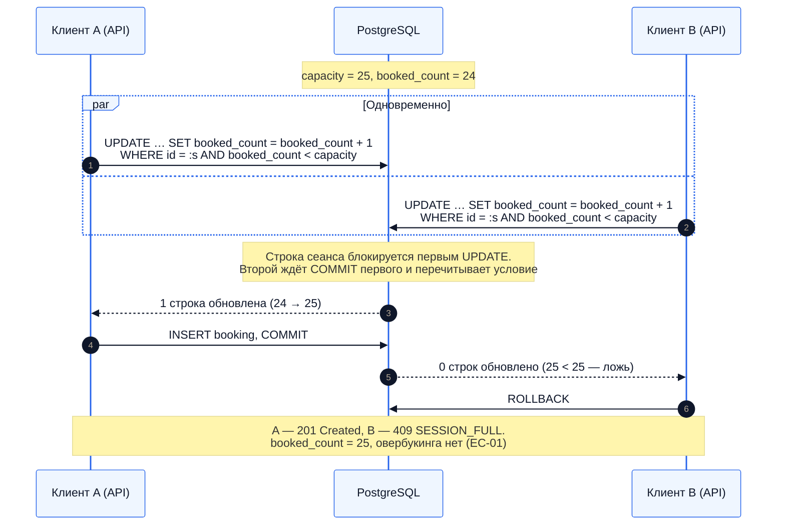
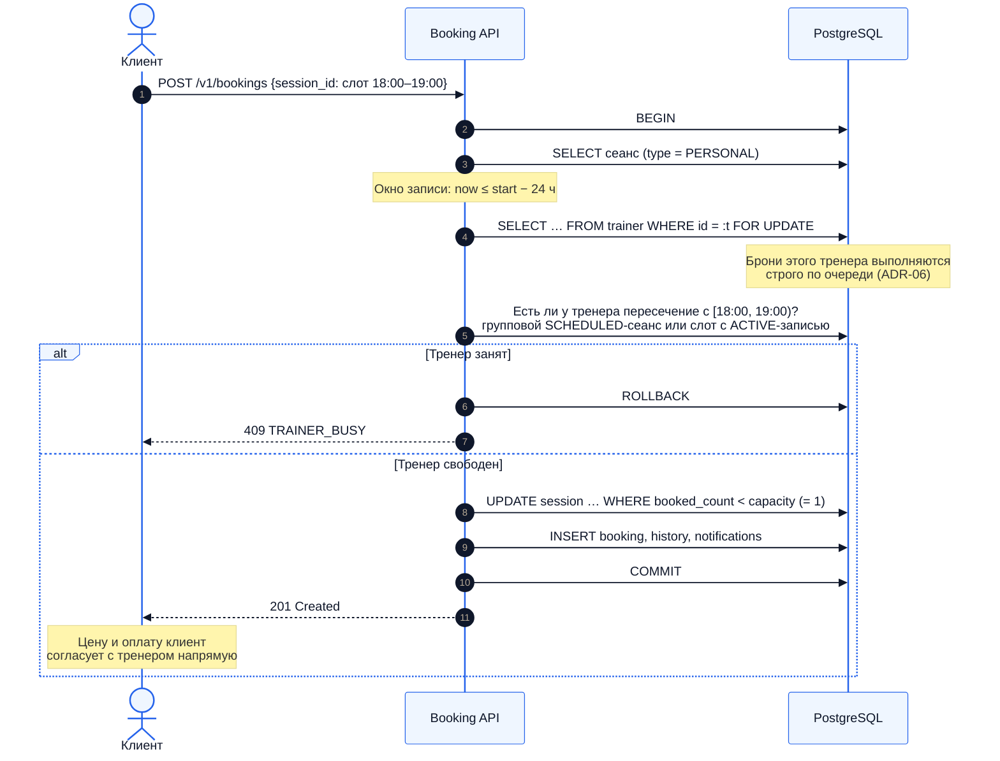
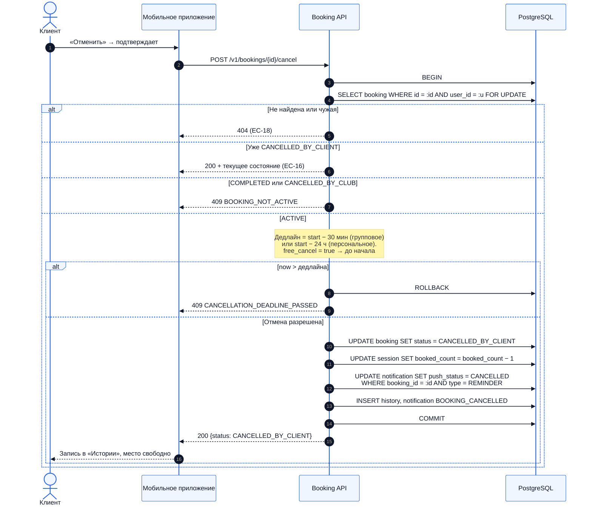
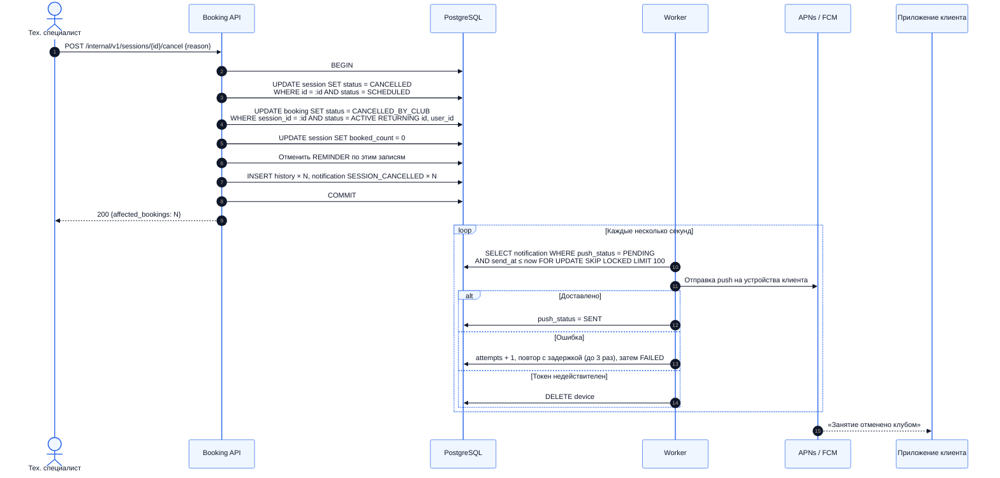

# 15. Диаграммы последовательности

Диаграммы показывают, **как контейнеры из C4 ([раздел 12](12-c4.md)) взаимодействуют во времени** в ключевых сценариях. Особое внимание уделено транзакциям: какие шаги выполняются атомарно и где стоят ограничения БД.

| # | Сценарий | UC | Что демонстрирует |
|---|---|---|---|
| SD-1 | Запись на групповое занятие | UC-03 | Порядок проверок, атомарное занятие места, outbox |
| SD-2 | Гонка за последнее место | UC-03 | Корректность при конкурентном доступе |
| SD-3 | Бронь персонального слота | UC-04 | Блокировка тренера и проверка его занятости |
| SD-4 | Отмена записи клиентом | UC-06 | Дедлайн, атомарный возврат места, отмена напоминания |
| SD-5 | Отмена сеанса клубом и доставка push | UC-08, UC-11 | Массовая отмена в одной транзакции, работа Worker |

## SD-1. Запись на групповое занятие

**Ключевые моменты**
- Занятие места, создание записи, история и уведомления фиксируются **одним COMMIT**. Частичного состояния не бывает.
- Условие `booked_count < capacity` проверяется в самом `UPDATE`. Отдельное чтение «сколько мест осталось» с последующей записью дало бы гонку (см. SD-2).
- Если параллельно проскочит вторая запись того же клиента, её отклонит уникальный индекс, а пересечение — exclusion-ограничение ([13.3](13-er-model.md#133-ограничения-целостности)). Такая ошибка БД транслируется в `ALREADY_BOOKED` или `CLIENT_TIME_CONFLICT`.
- Напоминание не создаётся, если до начала меньше 2 часов (FR-26).

## SD-2. Гонка за последнее место

Уровень изоляции — стандартный `READ COMMITTED`: в PostgreSQL при `UPDATE` конкурирующая транзакция ждёт снятия блокировки строки и заново проверяет условие `WHERE` на актуальной версии строки. Поэтому дополнительные блокировки не нужны.

## SD-3. Бронь персонального слота

Блокировка строки тренера нужна потому, что два клиента могут одновременно бронировать **разные**, но пересекающиеся слоты одного тренера (18:00–19:00 и 18:30–19:30). Условный `UPDATE` защищает только один сеанс, а блокировка сериализует все брони тренера (EC-12).

## SD-4. Отмена записи клиентом

`FOR UPDATE` на записи защищает от двойной отмены параллельными запросами: второй запрос дождётся первого, увидит статус `CANCELLED_BY_CLIENT` и не уменьшит счётчик повторно.

## SD-5. Отмена сеанса клубом и доставка push

`FOR UPDATE SKIP LOCKED` позволяет запускать несколько экземпляров Worker: каждый забирает свою пачку уведомлений, и ни одно не отправляется дважды. Тот же обработчик отправляет напоминания: это уведомления `REMINDER`, у которых наступило `send_at`.
